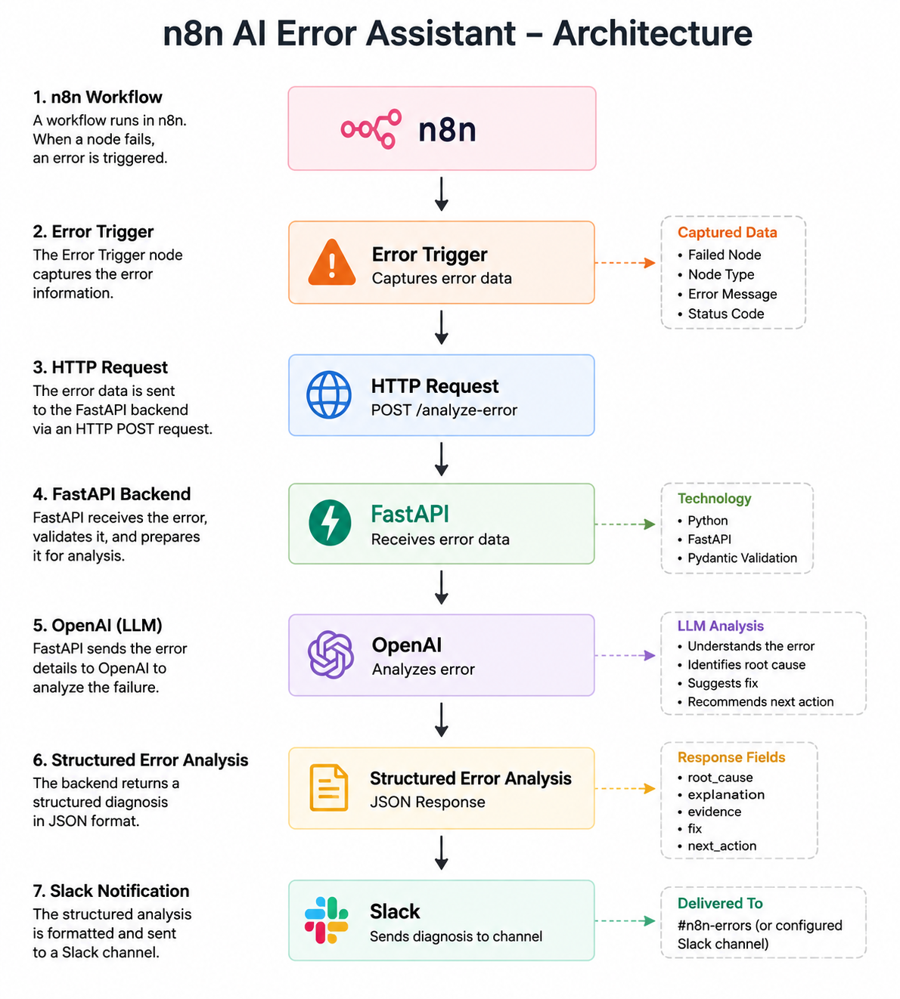
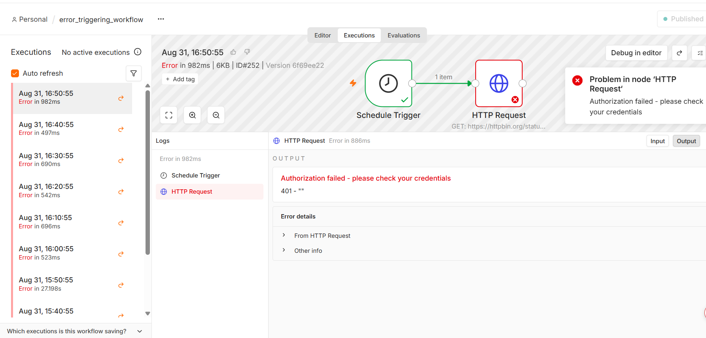
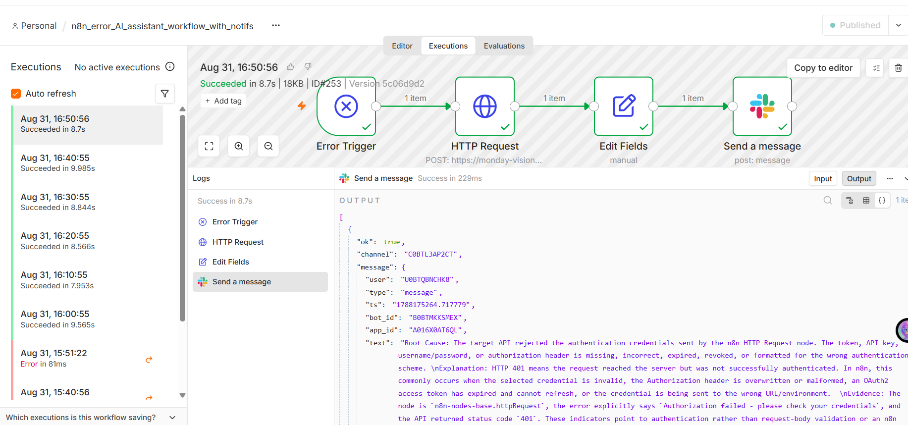
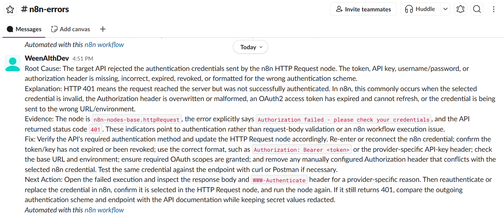

# n8n AI Error Assistant

An AI-powered error diagnosis assistant for n8n workflows.

When an n8n workflow fails, the Error Trigger sends the error information to a FastAPI backend. The backend uses OpenAI to analyze the error and return a structured diagnosis. The result is then sent to a Slack channel.

## Architecture



The project consists of two n8n workflows connected to a FastAPI backend.

```text
┌──────────────────────────────┐
│ Workflow 1: Error Generator  │
└──────────────┬───────────────┘
               │
               ▼
       Schedule Trigger
               │
               ▼
         HTTP Request
               │
               ▼
          HTTP 401 Error
               │
               │ triggers error workflow
               ▼
┌──────────────────────────────┐
│ Workflow 2: AI Error Assist  │
└──────────────┬───────────────┘
               │
               ▼
         Error Trigger
               │
               ▼
     HTTP POST /analyze-error
               │
               ▼
        FastAPI Backend
               │
               ▼
            OpenAI
               │
               ▼
     Structured JSON Analysis
               │
               ▼
          Edit Fields
               │
               ▼
       Slack Notification
```

## Workflow 1 — Error Generator

The first workflow is used to simulate a real n8n workflow failure.



```text
Schedule Trigger
       ↓
HTTP Request
       ↓
HTTP 401 Error
```

The workflow runs on a schedule and sends a request to a test endpoint that intentionally returns an HTTP 401 error.

The workflow is configured with the AI Error Assistant as its error workflow. When the HTTP Request fails, n8n automatically triggers the second workflow.

## Workflow 2 — AI Error Assistant

The second workflow receives the error generated by the first workflow and analyzes it.



```text
Error Trigger
       ↓
HTTP Request
       ↓
Edit Fields
       ↓
Slack
```

### Error Trigger

The Error Trigger receives information about the failed n8n execution, including:

- Failed node
- Node type
- Error message
- HTTP status code

### FastAPI Analysis

The HTTP Request node sends the extracted error information to:

```text
POST /analyze-error
```

The FastAPI backend validates the request and sends the error information to OpenAI for analysis.

### Structured AI Response

The backend returns a structured JSON response containing:

```text
root_cause
explanation
evidence
fix
next_action
```

The Edit Fields node combines these fields into a readable error report.

## Slack Notification

The final error report is sent to the configured Slack channel.


Example:

```text
Root Cause: Invalid API key

Explanation: The API rejected the supplied credentials.

Evidence: The HTTP request returned status code 401.

Fix: Update the API credentials used by the HTTP Request node.

Next Action: Verify the API key and rerun the workflow.
```

This allows a developer to receive an AI-generated diagnosis without manually inspecting the failed n8n execution.

## Features

- Captures n8n workflow errors
- Extracts the failed node, node type, error message, and status code
- Sends error information to a FastAPI backend
- Uses an LLM to analyze the failure
- Produces structured error analysis
- Sends the diagnosis to Slack

## Project Structure

```text
n8n_error_assistant/
├── .env
├── .gitignore
├── README.md
├── requirements.txt
├── assets/
│   └── architecture.png
├── workflow/
│   └── n8n-ai-error-assistant.json
├── app/
│   ├── analyser.py
│   ├── main.py
│   └── models.py
└── tests/
```

## Setup

Install the dependencies:

```bash
pip install -r requirements.txt
```

Create a `.env` file containing the required API credentials.

**Do not commit `.env` to GitHub.**

## Run the FastAPI Server

```bash
uvicorn app.main:app --reload
```

The API exposes:

```text
POST /analyze-error
```

## ngrok

Expose the local FastAPI server so that n8n Cloud can reach it:

```bash
ngrok http 8000
```

Use the generated HTTPS URL in the n8n HTTP Request node:

```text
https://YOUR-NGROK-DOMAIN/analyze-error
```

## n8n Configuration

The Error Assistant workflow uses:

```text
Error Trigger
    ↓
HTTP Request
    ↓
Edit Fields
    ↓
Slack
```

The Error Trigger data is mapped into:

```text
node
node_type
error
status_code
```

## AI Output

The AI returns a structured analysis containing:

```text
root_cause
explanation
evidence
fix
next_action
```

The formatted result is then sent to the configured Slack channel.

## Example

A failing HTTP Request returning:

```text
401 Unauthorized
```

is analyzed by the assistant and converted into a developer-oriented diagnosis containing:

- Root cause
- Explanation
- Evidence
- Recommended fix
- Next action

## Status

**Prototype 1 — Functional MVP**